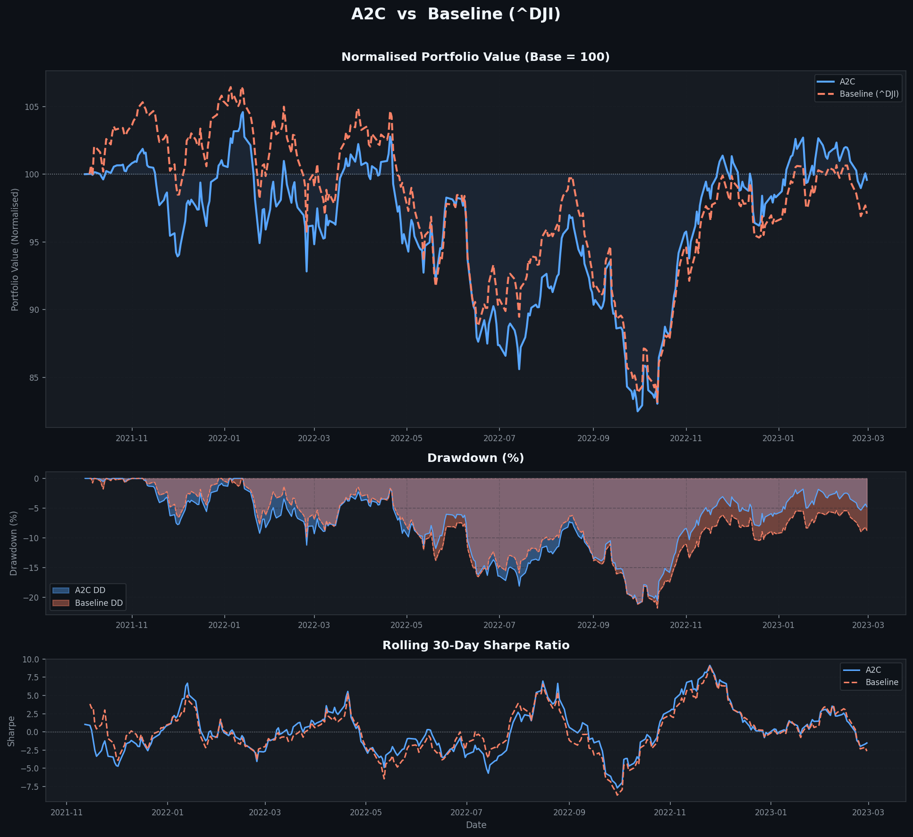
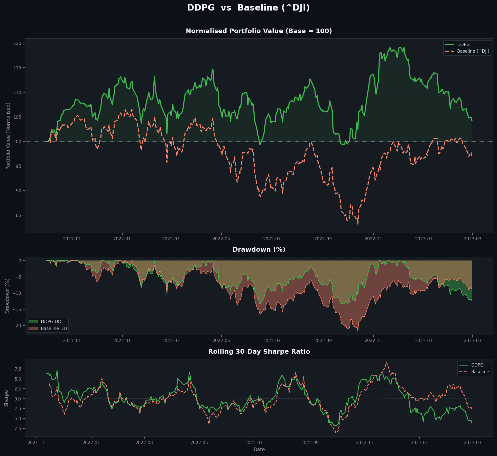
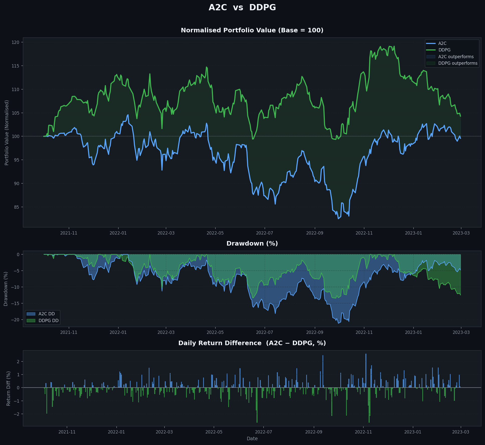
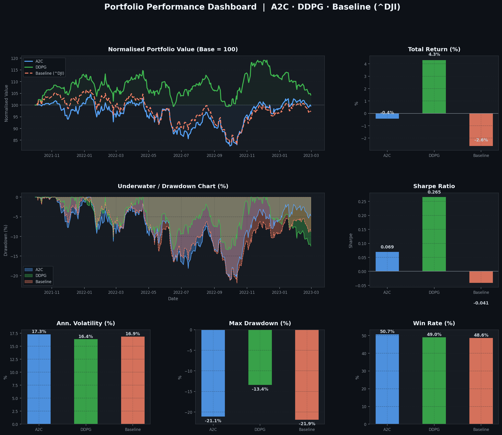

# RL Stock Trading — A Multifaceted Approach

> A Deep Reinforcement Learning framework for automated multi-stock trading using **A2C** and **DDPG** agents, validated on the **Dow Jones 30** constituent stocks.

Based on: *"A Multifaceted Approach to Stock Market Trading Using Reinforcement Learning"* — Ansari et al., IEEE Access, Vol. 12, 2024. [DOI](https://doi.org/10.1109/ACCESS.2024.3418510)

---

## Overview

This project implements a Deep Reinforcement Learning (DRL) strategy for automated multi-stock trading. The agent's state is enriched by fusing three categories of market data — **daily historical prices**, **technical indicators**, and **fundamental indicators** — enabling more informed, risk-aware trading decisions.

The agent manages a portfolio of multiple stocks simultaneously, issuing buy/hold/sell signals with share quantities per stock per trading day.

---

## Architecture & State Space

Formulated as a **Partially Observable Markov Decision Process (POMDP)**.

**State inputs (DTF protocol):**
- **Daily (OHLCV):** Open, High, Low, Close, Volume
- **Technical:** MACD, RSI, CCI, DMI/ADX, Turbulence
- **Fundamental (Alpha Vantage):** Liquidity, Leverage, Efficiency, and Profitability ratios (resampled quarterly → daily)

**Action Space:** `{-100, ..., 0, ..., +100}` shares per stock (buy/hold/sell + quantity)

**PSR Reward Function:**
```
Reward = ΔPortfolio + Sharpe Ratio + 0.9 × Daily Returns
```
Encourages portfolio growth, risk-adjusted returns, and short-term profitability simultaneously.

---

## RL Algorithms

**A2C (Advantage Actor-Critic)** — Uses an advantage function to reduce gradient variance. Synchronized updates suit large batch stock data.
```
∇J(θ) = E[ Σ ∇θ log πθ(at|st) · A(at|st) ]
A(at|st) = r(st, at, st+1) + γV(st+1) − V(st)
```

**DDPG (Deep Deterministic Policy Gradient)** — Handles continuous action spaces via replay buffer + target networks. Ideal for continuous portfolio sizing.
```
yi = ri + γQ'(si+1, μ'(si+1 | θμ') | θQ')
θQ' ← τθQ + (1 − τ)θQ'
```

---

## Results

Backtesting period: **2021-10-01 → 2023-03-01** | Initial Portfolio: **₹1,000,000** | Baseline: **^DJI Index**

| Metric | A2C | DDPG | ^DJI Baseline |
|---|---|---|---|
| Final Portfolio Value | ₹995,772 | **₹1,042,937** | ₹973,588 |
| Total Return | -0.42% | **+4.29%** | -2.64% |
| Annual Return | 1.20% | **4.34%** | -0.70% |
| Annual Volatility | 17.32% | **16.36%** | 16.86% |
| Sharpe Ratio | 0.069 | **0.265** | -0.041 |
| Max Drawdown | -21.12% | **-13.40%** | -21.85% |
| Calmar Ratio | 0.057 | **0.324** | -0.032 |
| Win Rate | **50.71%** | 49.01% | 48.58% |

**DDPG** outperforms both A2C and the ^DJI baseline across all key metrics — delivering a **+4.29% total return** and the lowest max drawdown of **-13.40%** compared to the baseline's **-21.85%**.

### Performance Charts

**A2C vs Baseline (^DJI)**


**DDPG vs Baseline (^DJI)**


**A2C vs DDPG**


**Full Dashboard**


---

## Project Structure

```
rl_stock_trading/
├── data/
│   ├── fetch_yahoo.py          # OHLCV data from Yahoo Finance
│   ├── fetch_alphavantage.py   # Fundamental data from Alpha Vantage
│   └── preprocess.py           # Feature engineering & data fusion
├── env/
│   └── stock_trading_env.py    # Custom multi-stock Gym environment
├── agents/
│   ├── a2c_agent.py
│   └── ddpg_agent.py
├── reward/
│   └── psr_reward.py           # PSR reward function
├── indicators/
│   ├── technical.py            # MACD, RSI, CCI, DMI, Turbulence
│   └── fundamental.py          # Financial ratios
├── train.py
├── backtest.py
└── requirements.txt
```

---

> ⚠️ **Disclaimer:** For research and educational purposes only. Not financial advice.
